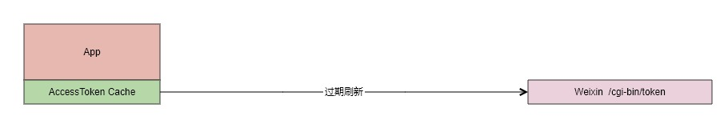
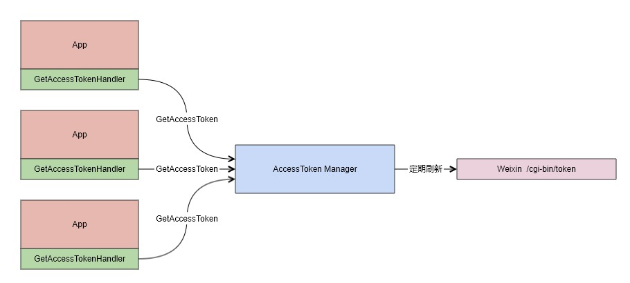

## AccessToken 管理

### 单实例服务

当只有一个服务实例的时候，可以简化 AccessToken 刷新机制：

- 从本地 AccessToken Cache 获取
- 如果不存在 或者 已过期，那么从微信服务器刷新&更新缓存
- 本地缓存默认使用文件方式，存放在系统临时目录下，可以通过`SetAccessTokenCacheDriver` 方法修改为内存或其他方式

**这是 fastwego/corporation  框架的默认刷新机制**

### 多实例服务

多个服务实例，如果都直接从微信服务器刷新 AccessToken ，会导致冲突

因为每次从微信服务器刷新 AccessToken 都会导致旧的 AccessToken 不可用，这样会就影响其他服务器

此时，需要引入 AccessToken Manager 中控服务，定期去微信服务器获取 AccessToken，例如：

- 启动定时任务，每 2 小时从微信服务器获取 AccessToken
- 将最新的 AccessToken 存储到 Redis 中，修改公众号实例的 AccessToken 获取机制 `SetGetAccessTokenHandler(f GetAccessTokenFunc)`，这样公众号实例每次调用微信 API 都会先从 Redis 中获取 AccessToken
- 显然，这种架构会增加网络延时 以及 引入 AccessToken Manager 单点风险，如果对服务可用性要求很高，可以考虑引入 Redis 主从等高可用架构

