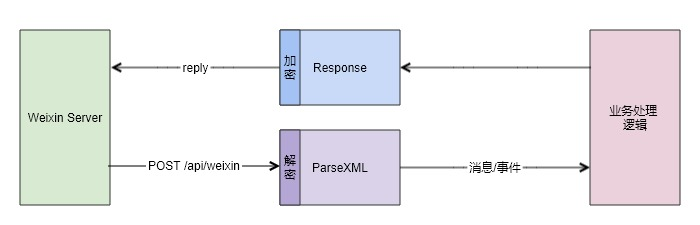

## 消息/事件 处理

- 接收到微信推送过来的消息/事件后，通过框架提供的 `ParseXML` 可以解析出对应的消息/事件类型
- 框根据配置的 `EncodingAESKey` 解密消息
- 开发者可以根据获取的消息/事件类型，完成具体的业务逻辑
- 如果需要即时回复用户文本/语音/图文等消息，构造相应的回复消息类型后，通过框架提供的 `Response` 方法输出内容
- 根据配置的 `EncodingAESKey` 加密消息后输出给微信
- 如果不需要即时回复用户消息，`Response` 会自动回复 `success` 告知微信服务器正常响应

完整用例请参见 [https://github.com/fastwego/wechat4work-demo](https://github.com/fastwego/wechat4work-demo)
